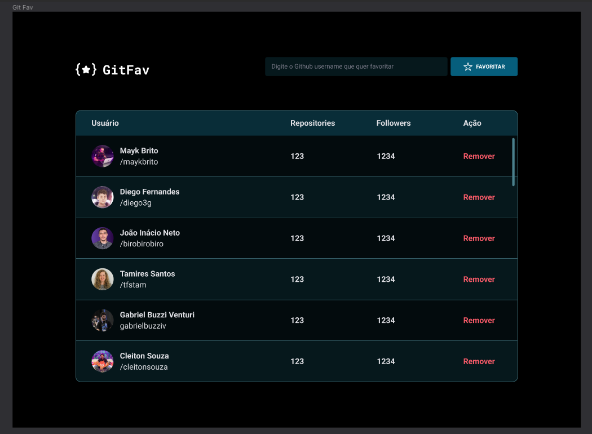

# GitFav
 
 o desafio era criar uma página onde fosse possivel adicionar vários perfil github como favorito, e deixar salvo no localstorage do navegador.

 

  <a href="#-tecnologias">Tecnologias</a>&nbsp;&nbsp;&nbsp;|&nbsp;&nbsp;&nbsp;
  <a href="#-projeto">Projeto</a>
  

## 🚀 Tecnologias

Esse projeto foi desenvolvido com as seguintes tecnologias:

- HTML
- CSS
- JavaScript

## 💻 Projeto

Aprendizado durante o projeto:

- Assíncrono e promises;
- Orientação a objetos;
- Classes e muito mais.
- localStorage.

 ## 📝 Licença

Esse projeto está sob a licença MIT. Veja o arquivo [LICENSE](LICENSE.md) para mais detalhes.

&nbsp;

Feito com 💜 by Jonas Martins👋

